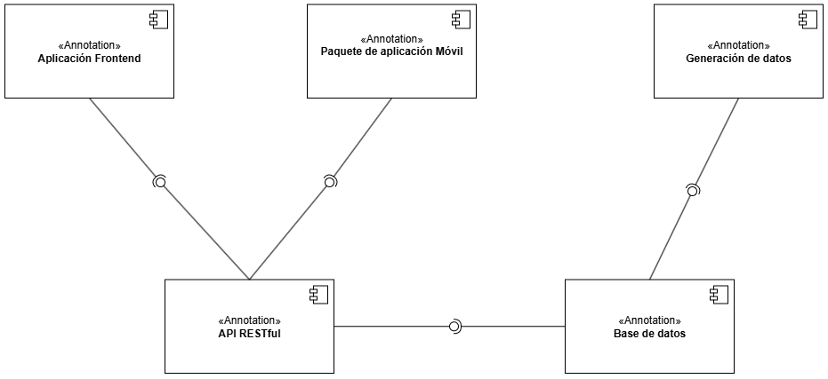
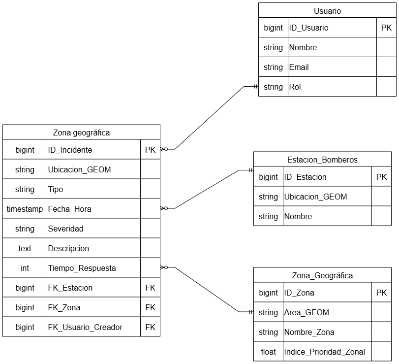
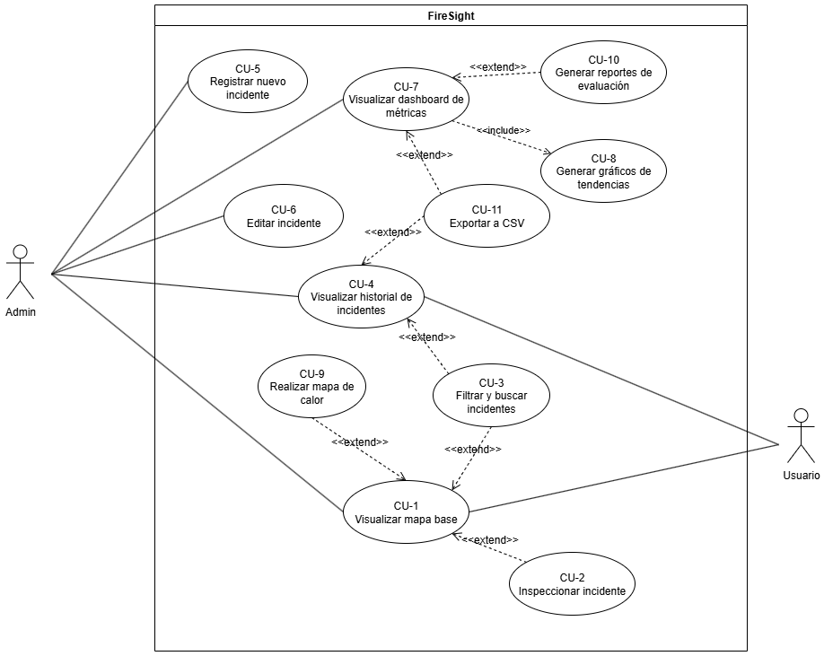
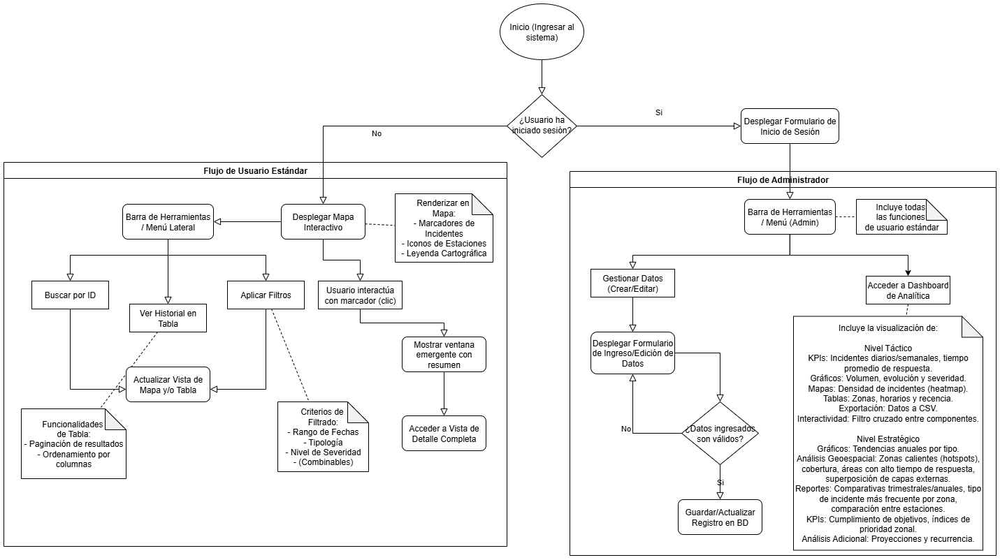
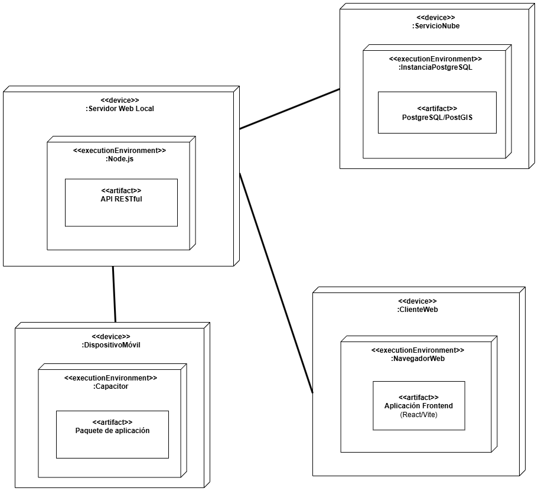

# A4 — Diseño de Proceso & Plan

---

[**Descargar Documento A4 completo en formato PDF**](LINK_A_LA_DESCARGA_DEL_PDF)

---

### Introducción y Arquitectura Global 

El propósito de este documento es detallar el diseño de FireSight, especificando sus componentes lógicos, su despliegue físico y los procesos que implementan los requerimientos definidos anteriormente. El diseño se fundamenta en los supuestos y restricciones ya establecidos y se utilizaron las vistas del Modelo 4+1 para asegurar una cobertura completa del diseño del software.

### Vista Lógica

La Vista Lógica se centra en la funcionalidad y la estructura interna del sistema, independiente de la tecnología específica o del despliegue.

#### Componentes del Sistema

El sistema se organiza en módulos lógicos que encapsulan funcionalidades específicas, garantizando la modularidad y la clara separación de responsabilidades.

#### Modelo de Dominio y Datos

El modelo de dominio define la estructura de datos que asegura la consistencia con los requisitos funcionales.

### Vista de Procesos

La Vista de Procesos describe la dinámica del sistema, la concurrencia y los flujos de control. Esto asegura que los componentes lógicos interactúen de manera coherente para cumplir los casos de uso definidos.

#### Casos de Uso y Escenarios Clave

El Diagrama de Caso de Uso define los escenarios funcionales clave que el sistema debe satisfacer, agrupados por rol (Usuario y Admin).

#### Flujo de Trabajo

El Diagrama de Flujo detalla las actividades y las interacciones para los diferentes niveles operativos del sistema. Se distingue claramente el Flujo de Usuario Estándar, enfocado en la visualización, filtros y búsqueda, del Flujo de Administrador, que incluye la gestión de datos.

### Vista de Desarrollo y Física

Esta vista describe la organización del software en el entorno de desarrollo y su topología física de ejecución.

#### Despliegue

El Diagrama de Despliegue muestra cómo los artefactos de software se asignan a los nodos de hardware y los entornos de ejecución.

### Trazabilidad y Coherencia Global

La Matriz de Trazabilidad es la evidencia de que todas las vistas son consistentes y que cada requisito está cubierto por al menos un elemento de diseño.

#### Matriz de Trazabilidad Consolidada (Requerimiento por Requerimiento)

| Req ID | Vista Lógica: Componente(s) de Software | Vista Lógica: Entidad(es) del Modelo ER | Vistas Procesos / Escenarios: Flujo/Caso de Uso | Justificación |
| :--- | :--- | :--- | :--- | :--- |
| **RF01** | Aplicación Frontend | N/A | Flujo Desplegar Mapa Interactivo (CU-1) | Carga inicial del mapa geográfico principal. |
| **RF02** | Aplicación Frontend, Leaflet.js | N/A | Flujo Desplegar Mapa Interactivo (CU-1) | El componente principal de la interfaz es el mapa interactivo. |
| **RF03** | Aplicación Frontend, Leaflet.js | N/A | Flujo Desplegar Mapa Interactivo (CU-1) | Funcionalidad básica de navegación cartográfica (zoom/pan). |
| **RF04** | Aplicación Frontend, Base de datos (PostGIS) | Incidente (Ubicacion\_GEOM) | Flujo Desplegar Mapa Interactivo (CU-1) | Renderización de la ubicación georreferenciada de los incidentes. |
| **RF05** | Aplicación Frontend, API RESTful | Incidente | Flujo Desplegar Mapa Interactivo (CU-1) | Despliegue de resumen de datos al interactuar con el marcador. |
| **RF06** | Aplicación Frontend, API RESTful | Incidente | Flujo de Usuario Estándar (Acceder a Vista de Detalle) | Obtención y visualización de todos los atributos del registro a través de la API. |
| **RF07** | Aplicación Frontend, API RESTful | Incidente | Flujo Aplicar Filtros (CU-3) | Filtro dinámico de datos por rango temporal. |
| **RF08** | Aplicación Frontend, API RESTful | Incidente | Flujo Aplicar Filtros (CU-3) | Filtro de datos por el campo Tipo de la entidad Incidente. |
| **RF09** | Aplicación Frontend, API RESTful | Incidente | Flujo Aplicar Filtros (CU-3) | Filtro de datos por el campo Severidad de la entidad Incidente. |
| **RF10** | Aplicación Frontend, API RESTful | Incidente | Flujo Aplicar Filtros (CU-3) | Lógica de negocio en la API para combinar múltiples filtros. |
| **RF11** | Aplicación Frontend, API RESTful | Incidente | Flujo Aplicar Filtros (CU-3) | Funcionalidad de búsqueda rápida por el campo ID\_Incidente. |
| **RF12** | Aplicación Frontend | Incidente | Flujo Ver Historial en Tabla | Presentación de los resultados de incidentes en formato tabular. |
| **RF13** | Aplicación Frontend | Incidente | Flujo Funcionalidades de Tabla | Implementación de la paginación de los resultados en la tabla. |
| **RF14** | Aplicación Frontend | Incidente | Flujo Funcionalidades de Tabla | Implementación de la ordenación ascendente/descendente por columna. |
| **RF15** | Aplicación Frontend, API RESTful | Incidente, Usuario | Flujo Gestionar Datos (Crear/Editar) (CU-5) | Interfaz y lógica de API para la creación de nuevos registros (requiere Rol de Usuario). |
| **RF16** | Aplicación Frontend, API RESTful | Incidente | Flujo Gestionar Datos (Crear/Editar) (CU-5) | Soporte para el ingreso de datos geoespaciales (lat/lon) y atributos clave. |
| **RF17** | API RESTful | N/A | Flujo Gestionar Datos (Crear/Editar) | Implementación de validaciones en la capa de la API para asegurar la integridad de los datos. |
| **RF18** | Aplicación Frontend | N/A | Flujo Desplegar Mapa Interactivo | Muestra la simbología de los elementos representados en el mapa. |
| **RF19** | Aplicación Frontend, Paquete de aplicación Móvil | N/A | Flujo de Usuario Estándar | Diseño de interfaz adaptable (responsivo) para escritorio y tabletas. |
| **RF20** | Aplicación Frontend, Base de datos (PostGIS) | Estacion\_Bomberos (Ubicacion\_GEOM) | Flujo Desplegar Mapa Interactivo | Visualización de la capa estática de ubicaciones de estaciones de bomberos. |
| **RF21** | Aplicación Frontend | N/A | Flujo Acceder a Dashboard de Analítica (CU-7) | Componente contenedor que muestra indicadores y resúmenes de datos. [11] |
| **RF22** | Aplicación Frontend, API RESTful | Incidente | Flujo Nivel Táctico (CU-7) | Cálculo y presentación del KPI de incidentes de las últimas 24 horas. |
| **RF23** | Aplicación Frontend, API RESTful | Incidente | Flujo Nivel Táctico (CU-7) | Agregación y presentación de incidentes por tipo de evento en la última semana. |
| **RF24** | Aplicación Frontend, API RESTful | Incidente | Flujo Nivel Táctico (CU-7) | Generación de gráfico de barras comparando tipologías de incidentes. |
| **RF25** | Aplicación Frontend, API RESTful | Incidente | Flujo Nivel Táctico (CU-7) | Gráfico de líneas que muestra la evolución diaria del volumen de incidentes. |
| **RF26** | Aplicación Frontend, API RESTful | Incidente | Flujo Nivel Táctico (CU-7) | Generación de gráfico circular de distribución de severidad. |
| **RF27** | Aplicación Frontend, API RESTful, Base de datos (PostGIS) | Incidente | Flujo Nivel Táctico (CU-9) | Capacidad de análisis espacial para generar visualización de densidad (heatmap). |
| **RF28** | Aplicación Frontend, API RESTful | N/A | Flujo Nivel Táctico | Control de la interfaz para ajustar el periodo de tiempo del mapa de calor. |
| **RF29** | Aplicación Frontend, API RESTful | Zona\_Geográfica | Flujo Nivel Táctico | Identificación y listado de zonas con mayor frecuencia de incidentes. |
| **RF30** | Aplicación Frontend | N/A | Flujo Nivel Táctico (Interactividad) | Lógica de la interfaz que permite filtrar el mapa al interactuar con un gráfico. |
| **RF31** | Aplicación Frontend, API RESTful | Incidente | Flujo Nivel Táctico | Cálculo y presentación del tiempo promedio de respuesta simulado. |
| **RF32** | Aplicación Frontend, API RESTful | Incidente | Flujo Nivel Táctico (CU-11) | Funcionalidad en la API para generar y exportar datos filtrados a formato CSV. |
| **RF33** | Aplicación Frontend, API RESTful | Incidente | Flujo Nivel Táctico | Presentación de incidentes agrupados por franja horaria. |
| **RF34** | Aplicación Frontend | N/A | Flujo Nivel Táctico | Control de filtro de fechas para la sincronización de todos los widgets del dashboard. |
| **RF35** | Aplicación Frontend, API RESTful | Incidente | Flujo Nivel Táctico | Panel dedicado a la lista de los incidentes más recientes. |
| **RF36** | Aplicación Frontend, API RESTful | Incidente | Flujo Nivel Estratégico (CU-8) | Gráfico de tendencias que muestra la evolución mensual de incidentes en el último año. |
| **RF37** | Aplicación Frontend, API RESTful, Base de datos (PostGIS) | Incidente, Zona\_Geográfica | Flujo Nivel Estratégico | Análisis geoespacial avanzado para la identificación de zonas con *alta concentración (hotspots)*. |
| **RF38** | Aplicación Frontend, API RESTful | Incidente | Flujo Nivel Estratégico | Cálculo del KPI de cumplimiento de tiempo de respuesta objetivo. |
| **RF39** | Aplicación Frontend, API RESTful | Incidente | Flujo Nivel Estratégico | Lógica de comparación de volumen de incidentes entre trimestres. |
| **RF40** | Aplicación Frontend, Base de datos (PostGIS) | Estacion\_Bomberos (Ubicacion\_GEOM) | Flujo Nivel Estratégico | Visualización de zonas de servicio alrededor de las estaciones (radio de 5 km). |
| **RF41** | Aplicación Frontend, API RESTful | Incidente, Zona\_Geográfica | Flujo Nivel Estratégico | Reporte que identifica el tipo de incidente más frecuente por área geográfica. |
| **RF42** | Aplicación Frontend, API RESTful | Incidente | Flujo Nivel Estratégico | Cálculo y presentación de una proyección lineal simple de incidentes futuros. |
| **RF43** | Aplicación Frontend, API RESTful | Incidente, Estacion\_Bomberos | Flujo Nivel Estratégico | Lógica de comparación de rendimiento (incidentes atendidos) entre estaciones. |
| **RF44** | Aplicación Frontend, API RESTful | Incidente | Flujo Nivel Estratégico | Gráfico de tendencia específica para un solo tipo de incidente a lo largo del tiempo. |
| **RF45** | Aplicación Frontend, API RESTful | Incidente, Zona\_Geográfica | Flujo Nivel Estratégico | Identificación de áreas donde el tiempo de respuesta simulado excede el promedio. |
| **RF46** | Aplicación Frontend, API RESTful | Incidente | Flujo Nivel Estratégico | Cálculo del KPI de la tasa de cambio de incidentes de alta severidad. |
| **RF47** | Aplicación Frontend, API RESTful | Incidente | Flujo Nivel Estratégico (CU-10) | Funcionalidad para generar un resumen anual consolidado de estadísticas. |
| **RF48** | Aplicación Frontend | N/A | Flujo Nivel Estratégico | Soporte para superposición visual de capas de datos externos (ej. infraestructura obsoleta). |
| **RF49** | Aplicación Frontend, API RESTful | Incidente | Flujo Nivel Estratégico | Análisis de recurrencia de incidentes en una misma ubicación geográfica. |
| **RF50** | Aplicación Frontend, API RESTful, Base de datos (PostGIS) | Zona\_Geográfica (Indice\_Prioridad\_Zonal) | Flujo Nivel Estratégico (CU-7) | Cálculo y presentación del índice clave de prioridad zonal (requiere datos de densidad y severidad). |

### Plan de Trabajo

Esta sección aborda la gestión del proyecto y el plan de ejecución, detallando cómo se organizará el trabajo para cumplir con los objetivos dentro del plazo establecido, basándose en la herramienta Trello para la planificación y el seguimiento.

#### Claridad del Plan de Trabajo (Roadmap e Iteraciones)

El plan de trabajo se basa en una metodología ágil que divide el desarrollo en fases/iteraciones manejables. Trello funciona como nuestro roadmap visual al permitirnos organizar las tareas en listas que representan las etapas del desarrollo.

*   **Hitos Temporales:** Las tarjetas en Trello se asignan a *sprints* (listas) con fechas de vencimiento, permitiendo una visualización clara del avance del proyecto.
*   **Entregables Esperados:** Cada tarjeta de Trello representa un entregable específico, lo que asegura claridad en los resultados intermedios.

#### Asignación de Roles y Responsabilidades

La asignación de responsabilidades es gestionada directamente en la plataforma Trello, cumpliendo con los criterios de la rúbrica.

*   **Identificación y Asignación:** Cada miembro del equipo tiene un rol asignado, y Trello se utiliza para **asignar explícitamente a los responsables** de cada tarea.
*   **Distribución de Tareas:** La visualización del tablero de Trello facilita el **seguimiento del trabajo repartido**, ayudando a prevenir la sobrecarga y fomentando la colaboración.

#### Gestión de Riesgos

Aunque las fuentes se centran en el diseño, la gestión de riesgos es fundamental. Para esta entrega, los riesgos serán documentados y seguidos en una lista dedicada en Trello.

*   **Identificación de Riesgos:** Se listarán riesgos técnicos (ej. complejidad de la integración de PostGIS) y de tiempo/recursos.
*   **Mitigación:** Se asignarán tarjetas de contingencia en Trello con responsables y fechas límite para proponer soluciones ante riesgos críticos.

| Riesgo (Ejemplo) | Impacto / Probabilidad | Estrategia de Mitigación (Trello Task) |
| :--- | :--- | :--- |
| **Riesgo Técnico:** Incompatibilidad al usar Capacitor con librerías geoespaciales avanzadas. | Alto / Medio | Investigación técnica (spike) para validar la compatibilidad antes de la implementación completa. |
| **Riesgo de Tiempo:** Retraso en la ingesta y validación del millón de datos sintéticos. | Alto / Medio | Asignación de una tarea prioritaria para optimizar los scripts de Python (GeoPandas) para una ejecución más rápida (OE2). |

#### Herramientas de Gestión y Seguimiento

Se han especificado las herramientas de gestión para la transparencia y la medición del avance [23].

*   **Herramientas Especificadas:** Trello es la herramienta principal para la planificación. GitHub se usa para el control de versiones, y Discord para la comunicación.
*   **Seguimiento del Progreso:** Trello permite medir el progreso moviendo las tareas entre las listas To Do, In Progress y Done, lo que refuerza la transparencia en la gestión.
*   **Evidencias de Uso:**

