## A6 — Descripción del MVP

[**Descargar Documento A6 completo en formato PDF**](assets/pdfs/A6.pdf)

---

## A6 — Introducción y Resumen Ejecutivo

Este documento describe el Producto Mínimo Viable (MVP) de FireSight, una plataforma diseñada para visualizar, gestionar y analizar incidentes históricos de incendios con el objetivo de mejorar la respuesta y planificación de las estaciones de bomberos.

El objetivo del MVP es validar la necesidad y la usabilidad de una herramienta centralizada que combine la visualización geográfica de los incidentes y las estaciones de bomberos con la capacidad de filtrado y análisis inicial de datos.

## A6 — Propósito y Alcance del MVP

El MVP de FireSight está centrado en proporcionar la funcionalidad mínima esencial para que los usuarios puedan:

### 1. Visualizar la distribución espacial de los incidentes históricos de incendios y las estaciones de bomberos.  
   Para priorizar el rendimiento del lado del cliente ante el manejo de grandes volúmenes de datos, se utiliza la técnica de clustering dinámico: al reducir el nivel de acercamiento, los incidentes se agrupan en clusters que muestran su conteo total, y al incrementar el nivel de acercamiento, los clusters se desagregan para visualizar los marcadores de incidentes de forma individual, garantizando una renderización eficiente y sin pérdida de rendimiento.

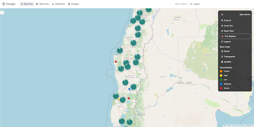
Figura 1 – Visualización de mapa (zoom out)

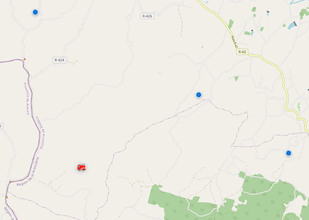
Figura 2 – Visualización de mapa (zoom in)

   La visualización móvil de usuario se somete a un ajuste responsivo de los componentes, enfocado en la visualización esencial del mapa. Se restringe el acceso a vistas analíticas secundarias (como Tabla, Strategic y Dashboard) para minimizar la carga y evitar sobrecarga de procesamiento.

   Dado que esta versión está dedicada al rol de Invitado, el acceso se gestiona de forma simplificada. Este diseño asegura que el personal operativo, como los bomberos, pueda acceder al sistema de manera inmediata sin el riesgo de fallar la autenticación o de demoras causadas por la gestión de credenciales, reconociendo que la rapidez de acceso es crucial en la toma de decisiones.
 
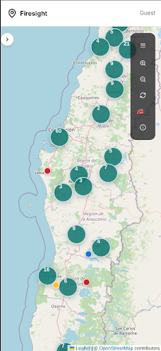
Figura 3 – Visualización de mapa (mobile)

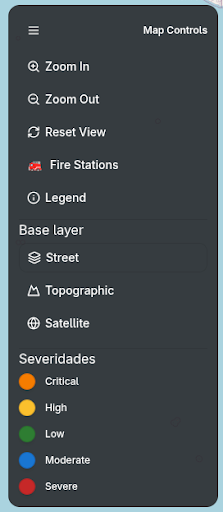
Figura 4 – Controles de mapa expandido

### 2. Consultar los detalles de un incidente específico.  
   Se realiza la consulta al momento de preguntar los detalles, para no sobrecargar el cliente y la API con miles de datos al mismo tiempo.

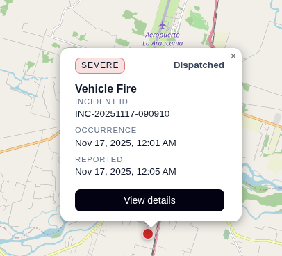
Figura 5 – Resumen incidente

   La plataforma asegura la precisión y actualización constante de las direcciones postales mediante la integración con una API pública de geocodificación. Esto permite la corrección dinámica de nombres de calles o numeración predial que puedan haber cambiado.

   Adicionalmente, para optimizar la respuesta operacional en campo, la funcionalidad "Go to Location" inicia una redirección directa a Google Maps. Esta integración facilita a los usuarios obtener indicaciones de navegación en tiempo real y establecer la ruta más eficiente hacia la ubicación del incidente.

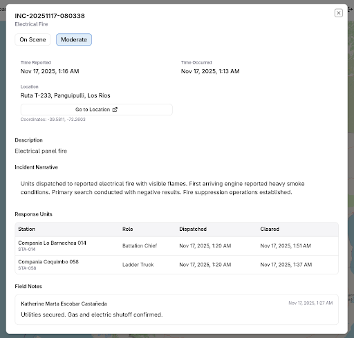
Figura 6 – Detalle incidente

### 3. Filtrar los datos según criterios básicos.  
   Se permite filtrar por rangos de fechas, tipos de incidentes, niveles de severidad y estado operativo del incidente (ej. Dispatched, On Scene, Resolved). El sistema actualiza dinámicamente el contador de registros visualizados en base a los filtros aplicados.

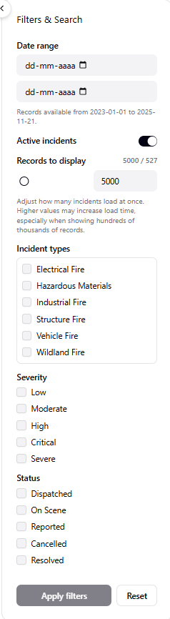
Figura 7 – Filtro administrador

   El administrador puede alternar la visualización entre el conjunto completo de datos históricos y únicamente los incidentes activos en el sistema.  
   Para priorizar la experiencia y el rendimiento del cliente, se otorga la posibilidad de controlar la cantidad máxima de registros a renderizar en la interfaz (límite de visualización). Adicionalmente, se aplica una lógica de renderización que prioriza geográficamente la carga de datos visibles, asegurando que los incidentes dentro del área actual de visualización (viewport) del mapa se muestran con prioridad.

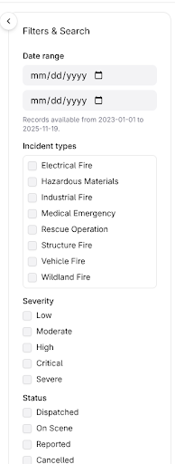
Figura 8 – Filtro invitado

   La versión móvil de la plataforma está diseñada específicamente para el rol de Invitado (Guest) y opera con restricciones clave tanto en el acceso a datos como en la funcionalidad de los filtros, lo que ayuda a priorizar el rendimiento en dispositivos móviles y a gestionar la exposición de información.  
   Los usuarios invitados no tienen acceso al conjunto completo de datos históricos de incidentes; su visualización se limita estrictamente a los incidentes actualmente activos en el sistema. Por esta razón, la opción de alternar la vista a "incidentes históricos" se deshabilita explícitamente en esta versión.  
   Dado que el volumen de incidentes activos es significativamente menor que el total histórico, la opción para que el usuario seleccione la cantidad de datos a renderizar se elimina, lo que simplifica la interfaz y permite que el sistema maneje automáticamente la carga óptima para un dispositivo móvil.

### 4. Visualizar datos históricos en formato de tabla.  
   Su utilidad principal radica en la capacidad de exportar la totalidad de los datos filtrados a formato CSV mediante el botón 'Export CSV', permitiendo al administrador realizar análisis externos o reportes manuales fuera de la plataforma.

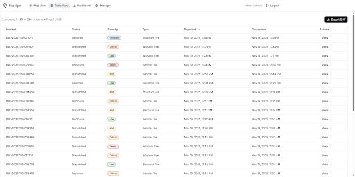
Figura 9 – Vista tabla

## A6 — Funcionalidades Incluidas en el MVP

| Componente | Funcionalidad Clave del MVP | Descripción |
| :--- | :--- | :--- |
| Plataforma Web | Acceso y navegación | Interfaz de usuario básica para acceder a las vistas principales. |
| Mapa Interactivo | Visualización de incidentes | Marcadores en el mapa que representan la ubicación de cada incidente de incendio histórico. |
| | Visualización de estaciones | Marcadores en el mapa que indican la ubicación de las estaciones de bomberos. |
| | Detalle del Incidente | Al hacer clic en un marcador, se muestra una ventana o panel con los detalles del incendio. |
| Vista de Tabla | Listado y Exportación | Visualización tabular de datos históricos con opción de descarga en formato CSV ("Export CSV") para análisis externo. |
| Filtros | Búsqueda y filtrado | Controles básicos para aplicar filtros a la información (ej. por rango de fechas, tipo de incidente, o severidad) en el Mapa y la Tabla. |
| App Mobile | Visualización de incidentes | Interfaz de usuario básica en aplicación móvil. Se puede navegar por el mapa viendo las marcas de los incidentes activos. |

---

## A6 — Funcionalidades Excluidas

Para mantener el enfoque en el MVP, las siguientes funcionalidades, aunque planificadas, están excluidas o se encuentran en una fase preliminar para esta primera versión:

- **Módulo Strategic (Análisis Avanzado)**: Modelos predictivos, análisis de zonas críticas y cálculos de tiempos de respuesta. Se encuentra en fase preliminar.

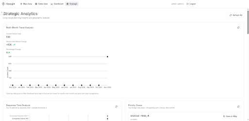
Figura 10 – Módulo Strategic (parte 1)

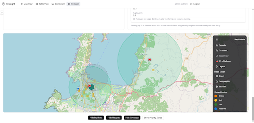
Figura 11 – Módulo Strategic (parte 2)

- **Gestión de Usuarios**: Creación de cuentas, roles de usuario y permisos (el MVP tiene un acceso de administrador predefinido y guest para el modo mobile). Aún no está implementado.

- **Módulo Dashboard**: Vista inicial con indicadores clave como la cantidad de incidentes recientes o la distribución de la severidad (ej. gráfico de barras o circular). Se encuentra en fase preliminar.

Figura 12 – Módulo Dashboard

- **Creación de nuevos registros**: Formulario con el cual poder ingresar nuevos registros de incendios a la base de datos. Aún no está implementado.

---

## A6 — Requisitos Técnicos Mínimos

| Aspecto | Requisito Mínimo del MVP |
| :--- | :--- |
| Base de Datos | Almacenamiento de un conjunto inicial de 100.000 datos históricos de incendios y ubicaciones de estaciones. |
| Tecnología de Mapa | Uso de la biblioteca de mapas Leaflet para la renderización del mapa y los marcadores. |
| Backend | API funcional para consultar y filtrar los datos de incidentes. |
| Frontend | Interfaz de usuario (UI) básica, responsiva para visualización en escritorio. |
| Mobile | Interfaz de usuario básica, responsiva para visualización del mapa en entorno móvil. |
| CI/CD mediante GitHub Actions | Pipeline de despliegue automatizado con soporte para topología dinámica. El sistema detecta automáticamente la configuración de red (IPs) para realizar un despliegue unificado (Frontend, Backend y BD en un solo servidor) o distribuido (servidores separados) sin modificar el código fuente, garantizando escalabilidad y reducción de errores. |

---

## A6 — Criterios de Éxito del MVP

El MVP de FireSight se considerará exitoso si se cumplen los siguientes criterios:

- **Funcionalidad**: El Mapa Interactivo carga, muestra y permite la consulta de los detalles de al menos 100.000 incidentes históricos y todas las estaciones de bomberos relevantes.
- **Usabilidad**: Los usuarios pueden aplicar y restablecer filtros básicos para acotar los resultados en el mapa y la tabla.
- **Rendimiento**: El tiempo de carga y renderización inicial de los marcadores de incidentes activos en el Mapa Interactivo no debe exceder los 5 segundos para un usuario con una conexión de banda ancha.
